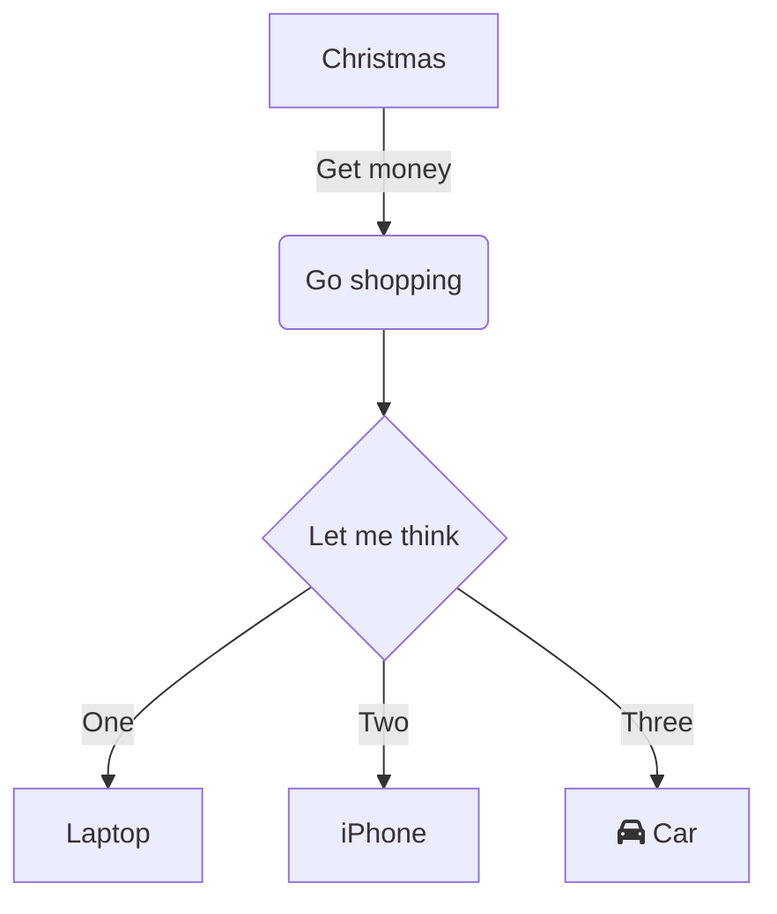

# DirectConnectの整理
### 使用メモ（未分類）
 - dxを介した相互通信→NG
 - dxリージョン間接続→DirectConnectGatewayとか使わないとできない

### 制限関連
　・Public/PrivateVIFの上限				　　　　　　　		　　　　　	50
　・TransitVIFの上限							　　　　　　　　　　　　　	1
　・リージョン、アカウント当たりのアクティブなDirectConnect専用線接続数		10
　・PrivateVIのBGP広報経路数				　　　　　　　　　　　			100
　・リージョンごとのLAG上限					　　　　　　　　　　　　		10
　・アカウント当たりのDirectConnectGateway			　　　　　　　		200
　・DirectConnectGatewayあたりの、、、
	VGW								　　　　　　　	10
	TransitGateway					　　			3
	VIF								　　　　　　　	30

### クロスコネクトの申請方法
LOA-CFAをダウンロードしたら、クロスネットワーク接続 (別名クロスコネクト) を完了する必要があります。
AWS Direct Connect ロケーションに機器を設置済みの場合は、適切なプロバイダに連絡して、クロスコネクトを完了します。
プロバイダごとの手順については、以下の表を参照してください。
クロスコネクトの価格設定については、プロバイダにお問い合わせください。クロスコネクトを確立したら、AWS Direct Connect コンソールを使用して仮想インターフェイスを作成することができます。

一部のロケーションは、キャンパスとして設定されます。詳細については、「AWS Direct Connect ロケーション」を参照してください。

AWS Direct Connect ロケーションに設置された機器をまだお持ちでない場合は、AWS パートナーネットワーク (APN) のいずれかのパートナー企業に設置の支援を依頼してください。AWS Direct Connect ロケーションに接続するのに役立ちます。詳細については、AWS Direct Connect をサポートしている APN パートナーを参照してください。クロスコネクトのリクエストを迅速に行うには、選択したプロバイダと LOA-CFA を共有してください。

AWS Direct Connect 接続では、他のリージョンのリソースにアクセスできます。詳細については、「リモート AWS リージョンへのアクセス」を参照してください。

graph TD
    A[Christmas] -->|Get money| B(Go shopping)
    B --> C{Let me think}
    C -->|One| D[Laptop]
    C -->|Two| E[iPhone]
    C -->|Three| F[fa:fa-car Car]
### WorkSpaces
 - ユーザ側のデバイス・通信要件
   - サポートするクライアントデバイス (PC、Mac、Linux、iPad、Android タブレット、または Android 対応 Chrome OS デバイス)
   - TCP ポート 443 と PCoIP 用 4172 または WSP 用 4195 のいずれか、および PCoIP 用 UDP ポート 4172 または WSP 用 4195 が開いているインターネット接続
     - ※内→外アクセスの事らしい 
    
### 物理構成
```
[VPC・AWS]--[DX-dvice]--(1G or 10G)--[顧客機器]--専用線--[オンプレミス]
 |          |                                  |                        |
 |--Amazon--|-----------DXロケーション---------|-------顧客用意---------|
 |          |                                  |                        |

```
 ・顧客機器は、顧客用意の場合と、パートナー（キャリアとか）が用意の場合がある。
 ・専用線は、キャリアの閉域網の場合もある。またオンプレがDXロケーションと同じ場合はWAN不要。


### 用語
　・Connection
　　物理的な回線。1G又は10G。マネコンでは「ポートスピード」で表示される。
　
　・VIF(VirtualInterface)
　　仮想的な回線。VLAN IDを持つ。1つのConnectionの中に複数のVIFを作成することが可能。
　　→Connectionが物理ポート、VIFがそこに割り当てるVLANという理解。

　・Hosted Virtaul Interface
　　Connectionを別アカウント（パートナー）が持っていて、そこからVIFが払い出されている場合のVIFのこと。
　　しかし明示的にマネコンに表示されるわけではなく、Connectiomも表示される。ただそのIDが自分のAWSアカウントとはならないだけ。

　・Hosted Connection (Sub 1G)
　　パートナーなどから払い出される仮想的なConnection。
　　500Mや100Mなど1G未満の接続となり、また割り当てられるVIFは通常のConnectionと異なり1IDのみ。
　　実体は、帯域付きHostedVIFのようなものだと理解でる。
　
　・DirectConnectロケーション
　　エクイニクスのDCなど、DirectConnectの物理的な接続ポイントの配置された場所のこと。


### DirectConnectGateway
 - マルチリージョンでの接続が可能（VGWは不可）
 - 複数のVPCのVGWやVIFをアタッチすることで、それらを相互接続することができるサービス。
 - プライベートVIF経由の接続で全リージョンの複数VPCと閉域で接続できるサービス
 - DirectConnectGatewayを用いたVPC間の接続、VIFから同じDXGに接続する別のVIF間の通信はNG
 - あくまでVIFを経由したオンプレ to VPCの通信のみ
 - 2019年現在ではマルチアカウントのVPC接続が可能。


### 仕様
- 監視について

　　通常のConnectionはCloudwatchで監視できる。HostedConnectionやVIFは不可。
　　そのため、オンプレ側の危機で何等か監視をする必要がある。
  
  - クロスコネクトでユーザのルータに必要な使用は、.1Q対応、BGPのmd5認証、シングルモード対応
 
  - 通常利用
    - 
  
 - 通常じゃない利用、Hosted Virtual Interface
   - Connection（回線）を別のアカウントが持っていて、そこからVIFが払い出されている場合の構成のこと
   - 

 - 料金体系
　　・AWSからのOutboundに課金
　　・Connection、VIFのオーナーアカウントに課金
　　・DirectConnectはポート時間（1時間単位）とデータ転送の２つで請求される。

 - LAG
　　複数のConnectionを最大４つまでLAGにまとめ負荷分散できる。

 - DirectConnectの開始方法
　　①DirectConnectロケーション、冗長有無、帯域の決定
　　②マネコンから接続リクエスト
　　③マネコンから許可書（接続施設割り当て"LOA－CFA"）をダウンロードでき、クロスコネクト接続のリクエストが可能になる。
　　④オンプレから接続する場合は、キャリアに申請する。
　　⑤キャリア、プロバイダにLOA－CFAを提供する。するとキャリアが接続を確立する。
　　⑥接続が確立されたらマネコンからVIFを作成する。


### 2つのVIFのタイプについて
- どこに（VPCなのか、AWSなのか、TransitGWなのか）つなぐVIFなのかでタイプが変わる。
- Puclic VIF
  - AWSのグローバルセグメントすべてに（＝VPC外のサービスにオンプレからダイレクトに）アクセスできるVIF
　　・S3やAmazon.comなどに割り当てられている約2000のプレフィックスが広報される。
　　・当然だがAWS以外のプレフィックス（グローバルセグメント）には、アクセスできない。
　　・ほぼインターネットであるため、利用する際はFWでフィルタすることが推奨されている。
　　・VPCとの接続にはVGWが必要。AS番号は独自のプライベートASNを使う、指定しない場合はデフォルトのASNが割り当てられる。
　　・最大1000経路までAWS側に広報できる。
　　・当然だがピアリングIPはパブリックである必要がある。かつ、顧客側が用意したパブリックでなければならない。
　　・ジャンボフレームはサポートしない。
　　・広報されるのはAmazonのパブリックプレフィックスのみのため、ほかの顧客のVIFから広報されたプレフィックスは見えない。（多分）


 - Private VIF
　　・PrivateIPでVPCにアクセスするためのVIF。
　　・MTUはデフォルト1500だが最大9001までサポートされている。（変更には停止が必要）

 - TransitVIF
　　・MTUはデフォルト1500だが最大8500までサポートされている。（変更には停止が必要）
　　

### DirectConnectのBGP関連
　・BGPの経路制御
　　・オンプレ→AWSはASパスプリペンド（待機系のASパスを増やす）
　　・オンプレ←AWSはLP（待機系のほうが値が小さくなるように）

　・MED属性
　　自身が広報する際にプレフィックス毎に付加できる値。メトリックが小さいほうが優先される。
　　例えば、自ASから対向のASに経路広報する際に、以下のようにMEDを付加することで宛先プレフィックス毎に経路分散できる。
　　 [Peer1 10.10.10.0/24:MED100, 192.168.1.0/24:MED200]
　　 [Peer2 10.10.10.0/24:MED200, 192.168.1.0/24:MED100]

　・ローカルプレファレンス
　　自AS内のIGPルータへ通知する際のメトリック。デフォルト100で値の大きいパスが優先される。

　・AWS側の経路選択の優先度（MEDでの制御も）
	↓ロンゲストマッチ
	↓BGPよりもSTATIC
	↓AS-PATH
	↓ORIGIN（IGP→EGP→？‗IGP-Redist）
	↓ルータID
	↓ネイバーのID

　・コミュニティ属性しらべる！


・インスタンスから自分のメタデータを取得する方法
<http://169.254.169.254/latest/meta-data/>

・cfn-init
　cloudFormationの拡張スクリプト


・拡張ネットワーキング
　―ppsの性能を高く、ネットワークジッター/レイテンシーを低くする方法
　―この機能では、従来の実装と比較し、I/O パフォーマンスが高く、CPU 利用率が低くなる新しいネットワーク仮想化スタックが使用される。
　―拡張ネットワーキングを最大限に利用するためには、VPC で HVM AMI を起動し、適切なドライバをインストールする必要がある。
　―EC2 インスタンスで拡張ネットワーキングを有効にする方法については、Linux の拡張ネットワーキングおよび Windows での
　　拡張ネットワーキングのチュートリアルを参照してください。
　　この機能を利用できるインスタンスについて、または詳細については、よくある質問の拡張ネットワーキングセクションを参照してください。


・S3が「HTTP 403: Access Denied」となる理由
　・AWS アカウント全体のバケットおよびオブジェクトを所有する所有者のアクセス許可
　　→S3オブジェクトの所有者はdefaultではアップロードしたAWSアカウントとなる。
　　　自分のバケットに他のアカウントがアップ可能ば場合、このようなアクセス不可が起きる。

　・バケットポリシーまたは AWS Identity and Access Management (IAM) ユーザーポリシー上の問題

　・Amazon S3 にアクセスするためのユーザー認証情報
　　→AWS SDK&AWS CLI は、IAM ユーザーの認証情報、またはバケットへの
　　　アクセス許可のあるIAMロールを使用するように設定されている必要がある。

　・VPC エンドポイントポリシー
　・ブロックパブリックアクセスの設定
　・存在しないオブジェクト
　　→「404 Not Found」ではなく403エラーで隠す仕様となっている。

　・AWS KMSによるオブジェクトの暗号化
　　→KMSで暗号化されている場合、IAMのアクセス権限以外に
　　　KMSキーポリシーで暗号化/復号化等のactionが許可されている必要がある。

　・バケットで有効化されているリクエスタ支払い
　　→バケットをリクエスタ支払いバケットとして設定すると、匿名でのアクセスが403errorとなる。
　　　リクエスタは、リクエストに x-amz-request-payer を (POST、GET、HEADの場合はヘッダーに、RESTの場合はパラメータとして) 含めることで、
　　　リクエストとデータのダウンロードに課金されることを了解している旨を示す必要がある

　・AWS Organizations のサービスコントロールポリシー
　　→IAMポリシーだけでなくSCPでも許可されている必要がある

・Cloud Front 詳細
　－web socketに対応
　－error 504：オリジンにアクセスできない、応答が遅い
　－error 403：CNAMEを設定していない、ディストリビューションが無効
　－udpは使えない。当たり前だけど。httpなのだから。
　－DirectConnectによりオンプレにオリジンサーバを配置することも可能。


・VPCエンドポイント
　Gateway方式とInterface方式があり、Gateway方式があるのはS3とDynamoだけ
　－Gateway方式
　　ルートテーブルのターゲットとして登録される。（IGWのような感じ）
　　エンドポイントにアクセスするインスタンス側のSGでの制御が必要。
　　VPC外からGWへのアクセスは出来ない。
　　－VPCエンドポイントポリシーの割当が出来る
　　　エンドポイントにアタッチ出来るIAMリソースポリシー。
　　　エンドポイントから指定されたサービス(S3/Dynamo)へのアクセスを制限できる。
　　　他のポリシー（S3の場合、IAMユーザポリシーやバケットポリシー）を上書きするものではない。（and条件で許可が必要）

　－Interface方式（別名Privatelink）
　　プライベートIPを持つENIとして登録される。
　　エンドポイント自体にSGを割り当ててIN/OUTを制限できる。
　　DirectConnectの場合だけ、VPC外からのアクセスが可能。

・特殊なインスタンスタイプ
　　P3    汎用 GPU インスタンスの最新世代です。
　　P2    汎用 GPU コンピューティングアプリケーション用に設計されています。
　　G4    機械学習推論やグラフィックを大量に使用するワークロードを迅速化するために設計されています。
　　G3    グラフィック集約型アプリケーション用に最適化されています。
　　F1    フィールドプログラマブルゲートアレイ (FPGA) によるカスタマイズ可能なハードウェアアクセラレーションが提供されま
　　→ネットワークアプライアンスのレイテンシを最小化するにはF1が最適

・EC2の準仮想化(PV)と完全仮想化(HVM)の違い
　PVはネットワークやディスクIOをエミュレーションせず、特別なドライバで操作する方式
　HVMは物理マシンのOSイメージをそのまま利用可能
　従来はPVのほうが性能がよかったが、最近はPV on HVMによりHVMでも同等以上の性能が可能
　https://awsjp.com/AWS/hikaku/paravirtualPV-Hardware-assistedVM-compare.html


・TransitVPC
　CiscoCSRとかlambdaを利用した自作TransitGatewayみたいなもの。

・CloudHUB
　VGWを中継点として複数のCGWをハブスポークで相互通信できるようにしたもの。CGWのAS番号が重複しないようにする必要がある。


・DHCPオプションセット
　EC2とかの起動時にIPと一緒に払い出すパラメータ一式。
　[domain-name-servers]
	最大4つまでのDNSサーバー、または AmazonProvidedDNSのIP アドレス。
	デフォルトのDHCPオプションセットでAmazonProvidedDNS が指定。
	複数のドメインネームサーバーを指定する場合は、カンマで区切る。
　[domain-name]
	us-east-1でAmazonProvidedDNS を使用している場合は、ec2.internalとなる。
	別のリージョンで AmazonProvidedDNSを使用している場合は、region.compute.internalとなる（例: ap-northeast-1.compute.internal）。
	それ以外の場合は、ドメイン名を指定する (例: example.com)。
　[ntp-servers]
	最大 4 つまでのNTPサーバーのIPアドレス。デフォルトは、Amazon Time Sync Serviceで、リンクローカルの169.254.169.123出来る。
　[netbios-name-servers]
	最大 4 つまでの NetBIOS ネームサーバーの IP アドレス。
　[netbios-node-type]
	NetBIOS ノードタイプ (1、2、4、8)。

　→NTPサーバを変更するには、新しいオプションセットを作成し、VPCの設定で割り当てられているオプションセットを変更する。

・DNS関連
【DNS一般】
・フォワーダ
　自分自身ではDNSの名前解決を行わず、別のフルサービスリゾルバへDNS要求を中継するDNSサーバ
　結果のキャッシュは行う。LANからインターネットへのクエリトラフィックを削減するために用いられる。

・CNAME
　(CNAMEレコードの例)---------------------------------------------
　server01.example.jp.   IN  A      192.168.20.31
　www1.example.jp.       IN  CNAME  server01.example.jp.
　www2.example.jp.       IN  CNAME  server01.example.jp.
　-----------------------------------------------------------------
　・別名に対し、正式名であるcinonicalレコード（server01）は、1つでなければならない。
　　上記の例だと、wwwは増やせるが、例えばwww1に対し複数のserver01、02みたいな指定はできない。

　・別のレコードがあるのにCNAMEを登録することはできない。
　　上記の例だとserver01を別名としたCNAMEは登録できない。

・Zone Apex（ゾーンの頂点）
　権威サーバが持つゾーンそのもののこと。
　この名前にはCNAMEを設定できない。それは同一の名前があるレコードのCNAMEは作成できないという制約に対して
　zone apexは、example.com NS <name server>というNSレコードを持つことがRFCで定められているため。
　https://www.atmarkit.co.jp/fnetwork/dnstips/008.html

・SRVレコード
　ドメイン内の共用的なサーバとかのIP/ポート番号を提供するレコード。
　SRVレコードに対応するクライアントであれば、使いたいサーバの情報を管理者に問い合わせることなく入手できる

 SRVレコードのフォーマット
 _Service._Proto.Name  TTL Class  SRV Priority  Weight  Port  Target
　(SRVレコードの例)------------------------------------------------
　_ftp._tcp.example.jp.   IN  SRV 1   0   21  server01.example.jp.
　_ftp._tcp.example.jp.   IN  SRV 2   0   21  server02.example.jp.
　server01.example.jp.    IN  A   192.168.20.31
　server02.example.jp.    IN  A   192.168.20.32
　-----------------------------------------------------------------


【AmazonProvidedDNS】
　・VPCのネットワークアドレスに2を加えたIPを持つ。
　・キャッシュサーバとしてのみ利用可能。
　・セットしたVPCのAmazonDNS以外からはアクセスできない。

【Route53】
　－AWSにより提供される権威サーバ。

　・Route53 Resolver
　　オンプレからAWS内の名前を解決できるリゾルバ/フォワーダ機能
　　プライベート空間のみ（オンプレかAWSのリソースの名前解決、AWSからオンプレのリソースの名前解決）可能
　　inboud方向とoutbound方向があり、エンドポイントとしてのIPが提供され、inboudの場合はそのIPをリゾルバ/フォワーダと指定することで
　　オンプレからAmazonDNS→Route53と名前解決できる。
　　https://qiita.com/rotekxyz/items/585635a5ccd806b651e7
　　https://dev.classmethod.jp/cloud/aws/route53-resolver/

　・ALIASレコードを指定できるリソース
　　CloudFront, ELB, static-website-s3-bucket, 他のRoute 53リソースレコードセット

　・レイテンシルーティング
　　全世界展開しているようなサービスを複数リージョンで提供している場合、レイテンシーベースルーティングを指定することでクライアントへのレイテンシを小さくすることができる。
　　クライアントがある名前のELBにアクセスした際、レイテンシーが小さくなるようなリージョンのELBのDNS名が返却されます。

【PrivateHostedとPablicHosted】
　－Privateは、オリジナルのローカルドメインを作成できる。
　　AmazonDNSで割り当てられる名前以外を使いたいときに利用する。
　　たとえば、パブリックのfqdnと同じものを使いたいがクライアントがVPCにいるときはVPCのIPを応答させたいなど。
　
・Amazon DNSサーバ（AmazonProvidedDNS）
　－AWSにより提供されるキャッシュサーバ（フルリゾルバ）。
　－VPC内からしか利用できない。
　－ルートヒント（ルートサーバのIP一覧）の編集不可。
　－フォワーダの編集不可
　－AWSとしては、IPとして169.254.169.253も使用可能だが、WindowsServer2008などでは使えない。

・Directory Service Microsoft AD
　AWS上に構築できるフルマネージドのADサーバ。


・WorkSpace
　クラウドベースの仮想デスクトップサービス。
　VPCへの要件として2つのプライベートサブネット、2つのパブリックサブネット、NATゲートウェイ又はEIPが必要。
　（OSインストールやアプリのデプロイのためWorkspaceからインターネットへのアクセスが必要）
　ユーザ認証のためのディレクトリサービスが必要
　　－AWS上に新規の場合は、Microsoft AD or Simple AD
　　－オンプレADと連携する場合、AD Connector
　利用にはクライアントソフトが必要
　クライアント側のネットワークでTCP/UDP4172,HTTPS,RTT<100msの要件を満たしている必要がある。

・VPC Flowlog
　L7レベルは見れない。（L4＋α）


・ALB　　
　- パスベース：リクエスト内のURLに基づいて、ターゲットグループへのルートを設定
　- ホストベース：要求されたドメインに基づいて、ターゲットグループへのルートを設定

・AWS inspector
　EC2に対して脆弱性診断ができるツール。エージェントが必要。以下のOSに対応。
　－Amazon Linux (2015.03 以降)
　－Ubuntu (14.04 LTS)
　－Red Hat Enterprise Linux (7.2)
　－CentOS (7.2)
　－Windows Server 2008 R2 および Windows Server 2012（β版）

・AWSでのパケットキャプチャ
　VPC flow log 以外だとVPC Traffic monitoringという機能がる。
　これはVPC内にTAPを構成し、ミラーしたパケットを解析のためのNLBやEC2に転送できる機能である。
　キャプチャしたパケットはsuricataやwiresharkで解析できる。
　　
・プレイスメントグループ
　同一AZ内のECをグループ化し、レイテンシを減らす方法


・AWSのAD関連サービスの種類
　・ADコネクター
　　ADプロキシーとしてオンプレのADの認証やマネコンへのSSOができる

　・SimpleAD
　　LinuxベースのADサービス。そこまでガチじゃない構成ならこっち。
　
　・MicrosoftAD
　　ガチのADサービス。大規模ならこっち。

ストレージgwの最安接続方法
QinQ使えるか
ebs最適化
クラウドフロント挟める構成パターン

＜参考＞
・準仮想化と完全仮想化の違い

http://blog.serverworks.co.jp/tech/2018/12/11/concepts-of-direct-connect/
http://aws-de-media.s3.amazonaws.com/images/AWS_Summit_2018/June7/Coral/AWS%20Direct%20Connect%20Deep%20Dive.pdf


＊Ephemeral port ：はかないポート。クライアント側として動的に割り当てられる一時的なポート番号
　　　　　　　　　 RFC6056では1024以上、IANA/UNIX/Windでは49152以上、Linuxは32768～61000、WinXP/2003以前は1025-5000


＜MPLS関連翻訳＞

・VPC over MPLSへの接続を実装するにはどうすればよいですか？
　ほとんどのAmazon Web Service（AWS）のお客様は、
　オンプレミスネットワークとAWSの間で確立するリモート接続の
　タイプ（VPNまたはAWS Direct Connect）をすばやく判断できます。
　マルチプロトコルラベルスイッチング（MPLS）を使用して地理的に
　分散した企業ネットワークを接続するお客様にとって、
　既存のMPLS接続を全体的なネットワーク設計に組み込む方法を理解することは困難です。
　このWebページは、Amazon Virtual Private Cloud（Amazon VPC）と
　MPLSネットワーク間の高可用性で効率的な接続の構築に役立つベストプラクティス、
　推奨事項、および一般的な構成をAWSのお客様に提供します。
                                                            
                                                            
                                                            
                                                            ■■■Networking■■■
・インスタンスから自分のメタデータを取得する方法
http://169.254.169.254/latest/meta-data/

・cfn-init
　cloudFormationの拡張スクリプト

・DirectConnect関連
　－BGPの経路制御
　　・オンプレ→AWSはASパスプリペンド（待機系のASパスを増やす）
　　・オンプレ←AWSはLP（待機系のほうが値が小さくなるように）
　－クロスコネクトでユーザのルータに必要な使用は、.1q対応、BGPのmd5認証、シングルモード対応
　－DirectConnectGateway
　　・プライベートVIF経由の接続で全リージョンの複数VPCと閉域で接続できるサービス
　　・DirectConnectGatewayを用いたVPC間の接続、VIFから同じDCGに接続する別のVIF間の通信はNG
　　・あくまでVIF to VPCの通信のみ
　－通常利用
　　http://corporate-tech-blog-wp.s3-website-ap-northeast-1.amazonaws.com/tech/wp-content/uploads/2018/12/DX_Normal.png
　－通常じゃない利用、Hosted Virtual Interface
　　・Connection（回線）を別のアカウントが持っていて、そこからVIFが払い出されている場合の構成のこと
　　http://corporate-tech-blog-wp.s3-website-ap-northeast-1.amazonaws.com/tech/wp-content/uploads/2018/12/DX_PartnerHostedVIF.png
　－料金体系
　　・AWSからのOutboundに課金
　　・VIFのオーナーアカウントに課金
　　・

・S3が403となる理由
vifのパブリックとプライベートの違い
dxを介した相互通信
オンプレとのdns連携
ストレージgwの最安接続方法
zone apexのレコード、alias x2か、alias.ptrか
ホストルーティング、パスルーティングの違い
dxリージョン間接続
bgpで使える属性
cloud hub
cloudfrontでudpいけるのか
ec2のntpサーバを変更する方法
dnsのtrue/host,resolv
dxの料金、マルチアカウントの場合誰に課金される
g2インスタンスとは
ec2のレイテンシをおさえる構成
拡張ネットワーキング
拡張ネットワークドライバ
mtu
s3エンドポイントに対するアクセス制御
トランジットvpc
aws workspaceの利用に必要なネットワーク要件
オンプレとのad連携
QinQ使えるか
ebs最適化
dx申請の流れと、必要な情報
albだけパブリックに見せる、可能か
レイテンシルーティングの詳細
クラウドフロント挟める構成パターン
aws inspectorとは
dpi、みるツール
flowlog、l7まで見れるのか

＜引用＞
http://blog.serverworks.co.jp/tech/2018/12/11/concepts-of-direct-connect/
http://aws-de-media.s3.amazonaws.com/images/AWS_Summit_2018/June7/Coral/AWS%20Direct%20Connect%20Deep%20Dive.pdf
