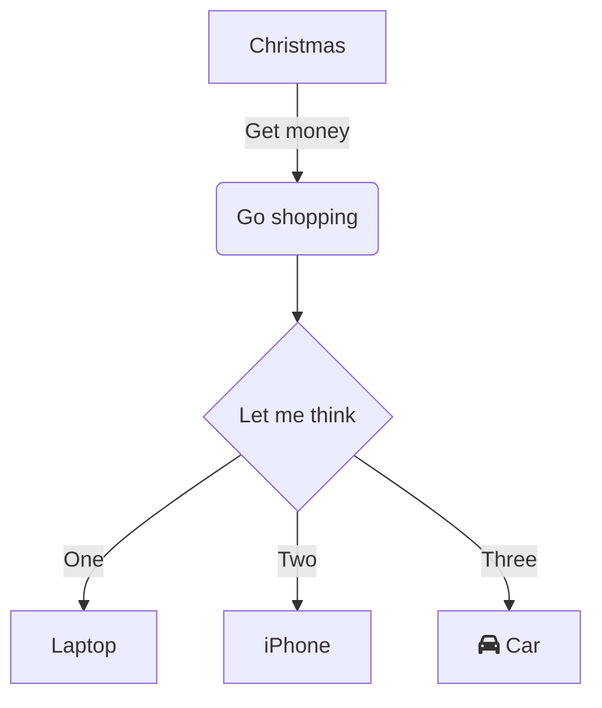

# 概要

[Blackblet](https://d1.awsstatic.com/webinars/jp/pdf/services/20210209-AWS-Blackbelt-DirectConnect.pdf)
[Blackbelt 2020/2/19](https://techstock.jp/wp-content/uploads/20200219_BlackBelt_Onpremises_Redundancy.pdf)

# 使用メモ（未分類）
 - dxを介した相互通信→NG
 - dxリージョン間接続→DirectConnectGatewayとか使わないとできない

# DirectConnect関連
　－クロスコネクトでユーザのルータに必要な使用は、.1q対応、BGPのmd5認証、シングルモード対応
　－DirectConnectGateway
　　・プライベートVIF経由の接続で全リージョンの複数VPCと閉域で接続できるサービス
　　・DirectConnectGatewayを用いたVPC間の接続、VIFから同じDCGに接続する別のVIF間の通信はNG
　　・あくまでVIF to VPCの通信のみ
　－通常利用
　　http://corporate-tech-blog-wp.s3-website-ap-northeast-1.amazonaws.com/tech/wp-content/uploads/2018/12/DX_Normal.png
　－通常じゃない利用、Hosted Virtual Interface
　　・Connection（回線）を別のアカウントが持っていて、そこからVIFが払い出されている場合の構成のこと
　　http://corporate-tech-blog-wp.s3-website-ap-northeast-1.amazonaws.com/tech/wp-content/uploads/2018/12/DX_PartnerHostedVIF.png
　－料金体系
　　・AWSからのOutboundに課金
　　・VIFのオーナーアカウントに課金
　
  現時点の疑問()
- マルチAZの場合のレイテンシは発生する(公式は考慮不要? とあるが実際はどうか)
→2msec程度はある。アプリ側でAZ跨ぐような通信があるか。その場合、どれくらいの遅延を許容できる仕様かによる
★はい、ご認識の通りです。
- AZ障害に対応できるNFSマウントできるマネージドサービスはあるか? EFSはAZフェイルオーバーはなさそう。
→いや、ある。
EFS自体はマルチAZで展開され、AZ毎にエンドポイントがあるから、AZ障害にも対応可能
★AZ-A の EFS エンドポイントが死んだ時に AZ-C のエンドポイントに自動切り替え(再マウント)される機能は無いです。
- SESでキャリアメールには問題なく送付可能? EC2からメール送付する場合、レピュテーション対策は必須?
→可能。レピュテーションは、迷惑メール送る様なメールサーバを立てるつもりなのか？
★そもそも SES はバウンス率が高いと送信制限が発生するサービスなので、B2C で使用するのは危険。おとなしく SendGrid あたりをつかいましょう。
　キャリアメールへの送信は SPF レコードをちゃんと設定すれば問題なし。
- RDS MultiAZよりはAurora?
→AuroraもRDSだか、使いたいDBエンジンと要求性能、コストで比較し決定する必要がある
★可用性を考慮するなら Aurora 一択。Aurora は RDS for XXX と違い、Zone にまたがってデータを保管する仕組みのため、フェイルオーバーが高速かつ信頼性も高い。通常の RDS XXX は、同様のインスタンスを作成し、レプリケーション等でデータの同期を行う必要があるため、レプリケーション中にダウンした場合はデータのロストが発生する。
　もちろんその分コストは高いので、お財布と要相談
- 各種ログ(LB、CloudTrail)をS3に格納するのでフォルダツリーがカオスになりそう。ツリー構造のサンプルを助言願いたい。
→べつにAWS関係ない。用途に応じて、運用性考慮しふつうに考える。
★ツリー構造は意識したことが無いので、持ち帰りの宿題。
　LB や CloudTrail 以外のログであれば、CloudWatchLogs で取得するのが簡単かつ、視認性が高い。

# 制限関連
| クォータ                                                            | 上限 | 
| ------------------------------------------------------------------- | ---- | 
| Public/PrivateVIFの上限                                             | 50   | 
| TransitVIFの上限                                                    | 1    | 
| リージョン、アカウント当たりのアクティブなDirectConnect専用線接続数 | 10   | 
| PrivateVIのBGP広報経路数                                            | 100  | 
| リージョンごとのLAG上限                                             | 10   | 
| アカウント当たりのDirectConnectGateway                              | 200  | 
| DirectConnectGatewayあたりの`VGW`                                   | 10   | 
| DirectConnectGatewayあたりの`TransitGateway`                        | 3    | 
| DirectConnectGatewayあたりの`VIF`                                   | 30   | 

# 物理構成

- 顧客機器は、顧客用意の場合と、パートナー（キャリアとか）が用意の場合がある。
- 専用線は、キャリアの閉域網の場合もある。またオンプレがDXロケーションと同じ場合はWAN不要。

# 用語
`Connection`
  - 物理的な回線。1G又は10G。マネコンでは「ポートスピード」で表示される。
　
 `VIF(VirtualInterface)`
 - 仮想的な回線。VLAN IDを持つ。1つのConnectionの中に複数のVIFを作成することが可能。
   - Connectionが物理ポート、VIFがそこに割り当てるVLANという理解。

`Hosted Virtaul Interface`
- Connectionを別アカウント（パートナー）が持っていて、そこからVIFが払い出されている場合のVIFのこと。
- しかし明示的にマネコンに表示されるわけではなく、Connectionも表示される。ただそのIDが自分のAWSアカウントとはならないだけ。

`Hosted Connection (Sub 1G)`
- パートナーなどから払い出される仮想的なConnection。
- 500Mや100Mなど1G未満の接続となり、また割り当てられるVIFは通常のConnectionと異なり1IDのみ。
- 実体は、帯域付きHostedVIFのようなものだと理解でる。

`DirectConnectロケーション`
- エクイニクスのDCなど、DirectConnectの物理的な接続ポイントの配置された場所のこと。

# 仮想インターフェース（VIF）
- どこに（VPCなのか、AWSなのか、TransitGWなのか）つなぐVIFなのかでタイプが変わる。
- Puclic VIF
  - AWSのグローバルセグメントすべてに（＝VPC外のサービスにオンプレからダイレクトに）アクセスできるVIF
  - S3やAmazon.comなどに割り当てられている約2000のプレフィックスが広報される。
  - 当然だがAWS以外のプレフィックス（グローバルセグメント）には、アクセスできない。
  - ほぼインターネットであるため、利用する際はFWでフィルタすることが推奨されている。
  - VPCとの接続にはVGWが必要。AS番号は独自のプライベートASNを使う、指定しない場合はデフォルトのASNが割り当てられる。
  - 最大1000経路までAWS側に広報できる。
  - 当然だがピアリングIPはパブリックである必要がある。かつ、顧客側が用意したパブリックでなければならない。
  - ジャンボフレームはサポートしない。
  - 広報されるのはAmazonのパブリックプレフィックスのみのため、ほかの顧客のVIFから広報されたプレフィックスは見えない。（多分）
 - Private VIF
   - PrivateIPでVPCにアクセスするためのVIF。
   - MTUはデフォルト1500だが最大9001までサポートされている。（変更には停止が必要）
 - TransitVIF
   - MTUはデフォルト1500だが最大8500までサポートされている。（変更には停止が必要）
　　
# Direct Connect + IPSec VPN
- Site-to-Site VPNにはPublic IPが必要となるため、Public VIFが必要となる。
- AWS側は、Public VIFの背後にVGWを配置し、Customerルータとの間にDX上にIPSecを構成できる。
- 

> 2022.7頃、アップデートによりPrivate VIFでもDX over VPNが可能になった。
> https://dev.classmethod.jp/articles/aws-site-to-site-vpn-now-supports-private-ip-vpn/
> 

***
### クロスコネクトの申請方法
LOA-CFAをダウンロードしたら、クロスネットワーク接続 (別名クロスコネクト) を完了する必要があります。
AWS Direct Connect ロケーションに機器を設置済みの場合は、適切なプロバイダに連絡して、クロスコネクトを完了します。
プロバイダごとの手順については、以下の表を参照してください。
クロスコネクトの価格設定については、プロバイダにお問い合わせください。クロスコネクトを確立したら、AWS Direct Connect コンソールを使用して仮想インターフェイスを作成することができます。

一部のロケーションは、キャンパスとして設定されます。詳細については、「AWS Direct Connect ロケーション」を参照してください。

AWS Direct Connect ロケーションに設置された機器をまだお持ちでない場合は、AWS パートナーネットワーク (APN) のいずれかのパートナー企業に設置の支援を依頼してください。AWS Direct Connect ロケーションに接続するのに役立ちます。詳細については、AWS Direct Connect をサポートしている APN パートナーを参照してください。クロスコネクトのリクエストを迅速に行うには、選択したプロバイダと LOA-CFA を共有してください。

AWS Direct Connect 接続では、他のリージョンのリソースにアクセスできます。詳細については、「リモート AWS リージョンへのアクセス」を参照してください。

# DirectConnectGateway

[参考ブログ](https://dev.classmethod.jp/articles/direct-connect-gateway/)
- DXとVPCなどとの接続を効率化するためのサービス。
- 複数のVPCのVGWやVIFをアタッチすることで、それらを相互接続することができるサービス。
- プライベートVIF経由の接続で全リージョンの複数VPCと閉域で接続できるサービス
- 従来はVIFとVPCを接続する場合、それらが`同一リージョン`に存在する必要があった。
- DX-GWにより、あるリージョンのDX専用線を使い、別リージョンからオンプレとの通信ができるようになる。
- マルチリージョンでの接続が可能（VGWは不可）
- DirectConnectGatewayを用いたVPC間の接続、VIFから同じDXGに接続する別のVIF間の通信はNG
- あくまでVIFを経由したオンプレ to VPCの通信のみ
- 2019年現在ではマルチアカウントのVPC接続が可能。

### 仕様
- 監視について
  - 通常のConnectionはCloudwatchで監視できる。HostedConnectionやVIFは不可。
  - そのため、オンプレ側の危機で何等か監視をする必要がある。
- クロスコネクトでユーザのルータに必要な使用は、.1Q対応、BGPのmd5認証、シングルモード対応 
- 通常利用
  - 
  
 - 通常じゃない利用、Hosted Virtual Interface
   - Connection（回線）を別のアカウントが持っていて、そこからVIFが払い出されている場合の構成のこと
   - 

- 料金体系
  - AWSからのOutboundに課金
  - Connection、VIFのオーナーアカウントに課金
  - DirectConnectはポート時間（1時間単位）とデータ転送の２つで請求される。

- LAG
  - 複数のConnectionを最大４つまでLAGにまとめ負荷分散できる。

- DirectConnectの開始方法
  1. DirectConnectロケーション、冗長有無、帯域の決定
  1. マネコンから接続リクエスト
  1. マネコンから許可書（接続施設割り当て"LOA－CFA"）をダウンロードでき、クロスコネクト接続のリクエストが可能になる。
  1. オンプレから接続する場合は、キャリアに申請する。
  1. キャリア、プロバイダにLOA－CFAを提供する。するとキャリアが接続を確立する。
  1. 接続が確立されたらマネコンからVIFを作成する。

## 冗長化
 - 迅速な切り替わりのためにはBFD有効が推奨。
 - DX側はデフォルト有効。対向ルータ側が有効にできれば成立。
 
## DirectConnectのBGP関連
 - BGPの経路制御
   - オンプレ→AWSはASパスプリペンド（待機系のASパスを増やす）
   - オンプレ←AWSはLP（待機系のほうが値が小さくなるように）

   - MED属性
     - 自身が広報する際にプレフィックス毎に付加できる値。メトリックが小さいほうが優先される。
     - 例えば、自ASから対向のASに経路広報する際に、以下のようにMEDを付加することで宛先プレフィックス毎に経路分散できる。
     - `[Peer1 10.10.10.0/24:MED100, 192.168.1.0/24:MED200]`
     - `[Peer2 10.10.10.0/24:MED200, 192.168.1.0/24:MED100]`

   - ローカルプレファレンス
     - 自AS内のIGPルータへ通知する際のメトリック。デフォルト100で値の大きいパスが優先される。

    - AWS側の経路選択の優先度（MEDでの制御も）
      - ↓ロンゲストマッチ
      - ↓BGPよりもSTATIC
      - ↓AS-PATH
      - ↓ORIGIN（IGP→EGP→？‗IGP-Redist）
      - ↓ルータID
      - ↓ネイバーのID

　・コミュニティ属性しらべる！
