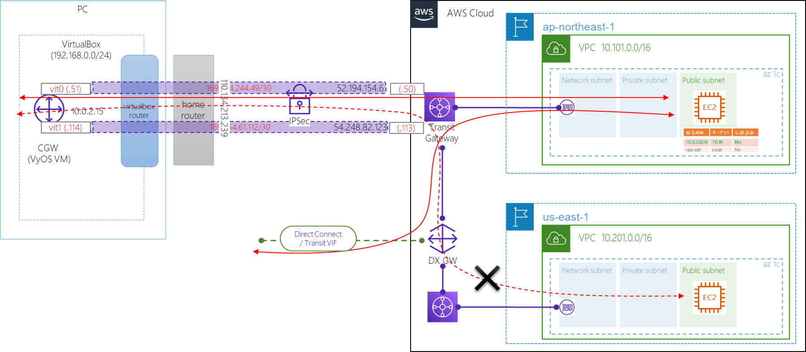

# Overview
- DX-GWでDirectConnectを複数リージョンで共用する構成。
- 各リージョン内は、VPC間通信を想定しTransit Gatewayで接続する。
- DirectConnectは準備できないので、あるものと想定して実際は作成しない。

# Diagram


- DX-GWは、Direct Connect経由の通信を提供するものなので、リージョン間の疎通は取れない。（Transit GWルートテーブルで別リージョンの経路は学習されない）

# Terraform

> Transit GW for JP
```terraform
locals {
  tgw = true
}

/* ---------------------------------
for Japan
----------------------------------- */
//Transit Gateway
resource "aws_ec2_transit_gateway" "tgw" {
  count = local.tgw ? 1 : 0

  auto_accept_shared_attachments = "enable"

  tags = {
    "Name" = "satoshi-tgw"
  }
}

// Transit Gaateway attachment to Network Subnet.
resource "aws_ec2_transit_gateway_vpc_attachment" "tgw" {
  count = local.tgw ? 1 : 0

  subnet_ids = [
    aws_subnet.network.id,
  ]
  transit_gateway_id = aws_ec2_transit_gateway.tgw.0.id
  vpc_id             = var.vpc.id

  tags = {
    "Name" = "tgw-attach-shared-vpc"
  }
}

// Add Route via VyOS for Public subnet
resource "aws_route" "public_tgw" {
  count = local.tgw ? 1 : 0

  route_table_id         = aws_route_table.pub.id
  destination_cidr_block = "10.0.2.0/24"
  transit_gateway_id     = aws_ec2_transit_gateway.tgw.0.id
}


```
> Direct Connect GW
```terraform
locals { dxgw = true }

resource "aws_dx_gateway" "test" {
  count = local.dxgw ? 1 : 0
  name            = "satoshi-dxgw"
  amazon_side_asn = "64600"
}


resource "aws_dx_gateway_association" "jp_tgx" {
  count = local.dxgw && local.tgw ? 1 : 0
  dx_gateway_id         = aws_dx_gateway.test.0.id
  associated_gateway_id = aws_ec2_transit_gateway.tgw.0.id

  allowed_prefixes = [
    "10.99.0.0/16", # VPC subnet
    "10.0.2.0/24",  # On-Premises subnet via VPN
  ]
}

resource "aws_dx_gateway_association" "us_tgx" {
  provider      = aws.us
  count = local.dxgw && local.tgw_us ? 1 : 0
  dx_gateway_id         = aws_dx_gateway.test.0.id
  associated_gateway_id = aws_ec2_transit_gateway.tgw_us.0.id

  allowed_prefixes = [
    "10.201.0.0/16", # US VPC Subnet
  ]
}

```

> Transit GW for US
```terraform
/* ---------------------------------
 Transit Gateway
----------------------------------- */
//Transit Gateway for US-EAST-1
resource "aws_ec2_transit_gateway" "tgw_us" {
  provider = aws.us
  count    = local.tgw_us ? 1 : 0

  auto_accept_shared_attachments = "enable"

  tags = {
    "Name" = "satoshi-tgw"
  }
}

// Transit Gaateway attachment to Network Subnet.
resource "aws_ec2_transit_gateway_vpc_attachment" "tgw_us" {
  provider = aws.us
  count    = local.tgw_us ? 1 : 0

  subnet_ids         = module.vpc["1"].private_subnets
  transit_gateway_id = aws_ec2_transit_gateway.tgw_us.0.id
  vpc_id             = module.vpc["1"].vpc_id

  tags = {
    "Name" = "tgw-attach-shared-vpc_us"
  }
}
```
