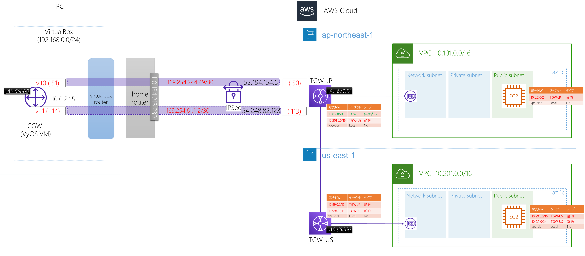

# Overview

### References
- [Transit Gatewayのルーティング仕様を分かりやすく解説してみる](https://blog.serverworks.co.jp/tech/2020/06/30/transit-gateway-routing/)

# Diagram



# AWS Resources
### Transit-GW for JP
- Transit GW
```terraform
locals {
  tgw     = true
  peer_us = true
}

/* ---------------------------------
 Transit-GW for Japan
----------------------------------- */
//Transit Gateway
resource "aws_ec2_transit_gateway" "tgw" {
  count = local.tgw ? 1 : 0

  auto_accept_shared_attachments = "enable"

  tags = {
    "Name" = "satoshi-tgw"
  }
}

// Transit Gaateway attachment to Network Subnet.
resource "aws_ec2_transit_gateway_vpc_attachment" "tgw" {
  count = local.tgw ? 1 : 0

  subnet_ids = [
    aws_subnet.network.id,
  ]
  transit_gateway_id = aws_ec2_transit_gateway.tgw.0.id
  vpc_id             = var.vpc.id

  tags = {
    "Name" = "tgw-attach-shared-vpc"
  }
}

// Add Route via VyOS for Public subnet
resource "aws_route" "public_tgw" {
  count = local.tgw ? 1 : 0

  route_table_id         = aws_route_table.pub.id
  destination_cidr_block = "10.0.2.0/24"
  transit_gateway_id     = aws_ec2_transit_gateway.tgw.0.id
}
```
- Transit-GW Peering
```terraform
/* ---------------------------------
 Transit-GW Peerings
----------------------------------- */
data "aws_region" "us" {
  provider = aws.us
}

// Peering Attachement JP to US
resource "aws_ec2_transit_gateway_peering_attachment" "jp_us" {
  count = local.tgw && local.tgw_us ? 1 : 0

  peer_region             = data.aws_region.us.name
  peer_transit_gateway_id = aws_ec2_transit_gateway.tgw_us.0.id
  transit_gateway_id      = aws_ec2_transit_gateway.tgw.0.id

  tags = {
    Name = "tgw-attache-for-peering-to-us"
  }
}

// Transit GW Route to US.
resource "aws_ec2_transit_gateway_route" "jp_us" {
  count = local.tgw && local.tgw_us ? 1 : 0

  destination_cidr_block         = module.vpc["1"].vpc_cidr_block
  transit_gateway_attachment_id  = aws_ec2_transit_gateway_peering_attachment.jp_us.0.id
  transit_gateway_route_table_id = aws_ec2_transit_gateway.tgw.0.association_default_route_table_id
}

```

### Transit-GW for US
- Transit-GW and Attachment
```terraform
/* ---------------------------------
 Transit Gateway
----------------------------------- */
//Transit Gateway for US-EAST-1
resource "aws_ec2_transit_gateway" "tgw_us" {
  provider = aws.us
  count    = local.tgw_us ? 1 : 0

  auto_accept_shared_attachments = "enable"

  tags = {
    "Name" = "satoshi-tgw"
  }
}

// Transit Gateway attachment to Network Subnet.
resource "aws_ec2_transit_gateway_vpc_attachment" "tgw_us" {
  provider = aws.us
  count    = local.tgw_us ? 1 : 0

  subnet_ids         = module.vpc["1"].private_subnets
  transit_gateway_id = aws_ec2_transit_gateway.tgw_us.0.id
  vpc_id             = module.vpc["1"].vpc_id

  tags = {
    "Name" = "tgw-attach-shared-vpc_us"
  }
}

```

- Route for Transit-GW Route table and Public Route table.
```terraform
// Add Route via JP-VPC for Public subnet
resource "aws_route" "via_jp_vpc_from_public" {
  provider = aws.us
  count    = local.tgw_us ? 1 : 0

  route_table_id         = module.vpc["1"].public_route_table_ids[0]
  destination_cidr_block = var.vpc.cidr
  transit_gateway_id     = aws_ec2_transit_gateway.tgw_us.0.id
}

resource "aws_route" "via_jp_vyos_from_public" {
  provider = aws.us
  count    = local.tgw_us ? 1 : 0

  route_table_id         = module.vpc["1"].public_route_table_ids[0]
  destination_cidr_block = "10.0.2.0/24"
  transit_gateway_id     = aws_ec2_transit_gateway.tgw_us.0.id
}

// Transit GW Route to US.
resource "aws_ec2_transit_gateway_route" "us_jp" {
  provider = aws.us
  count    = local.tgw && local.tgw_us ? 1 : 0

  destination_cidr_block         = var.vpc.cidr
  transit_gateway_attachment_id  = aws_ec2_transit_gateway_peering_attachment.jp_us.0.id
  transit_gateway_route_table_id = aws_ec2_transit_gateway.tgw_us.0.association_default_route_table_id
}

// Transit GW Route to JP-VyOS(via VPN).
resource "aws_ec2_transit_gateway_route" "us_jp-vyos" {
  provider = aws.us
  count    = local.tgw && local.tgw_us ? 1 : 0

  destination_cidr_block         = "10.0.2.0/24"
  transit_gateway_attachment_id  = aws_ec2_transit_gateway_peering_attachment.jp_us.0.id
  transit_gateway_route_table_id = aws_ec2_transit_gateway.tgw_us.0.association_default_route_table_id
}

```

# VyOS
- Routing Table
```
//US向けのルート（10.201.0.0/16）をAWS側からイコールコストで学習
vyos@vyos:~$ show ip route
~~
S>* 0.0.0.0/0 [210/0] via 10.0.2.2, eth0, weight 1, 00:51:58
C>* 10.0.2.0/24 is directly connected, eth0, 00:51:59
B>* 10.99.0.0/16 [20/100] via 169.254.61.113, vti1, weight 1, 00:51:03
  *                       via 169.254.234.49, vti0, weight 1, 00:51:03
B>* 10.201.0.0/16 [20/100] via 169.254.61.113, vti1, weight 1, 00:03:33
  *                        via 169.254.234.49, vti0, weight 1, 00:03:33
C>* 169.254.0.0/16 is directly connected, eth2, 00:51:59
C>* 169.254.61.112/30 is directly connected, vti1, 00:51:58
C>* 169.254.234.48/30 is directly connected, vti0, 00:51:57
```

# Ping
- AWS-JP -> AWS-US
```
 $ ping 10.201.33.240
PING 10.201.33.240 (10.201.33.240) 56(84) bytes of data.
64 bytes from 10.201.33.240: icmp_seq=1 ttl=252 time=147 ms
64 bytes from 10.201.33.240: icmp_seq=2 ttl=252 time=145 ms
64 bytes from 10.201.33.240: icmp_seq=3 ttl=252 time=145 ms
64 bytes from 10.201.33.240: icmp_seq=4 ttl=252 time=145 ms
64 bytes from 10.201.33.240: icmp_seq=5 ttl=252 time=145 ms
```

- VyOS -> AWS
```
//To JP
vyos@vyos:~$ ping 10.99.31.172 source-address 10.0.2.15
PING 10.99.31.172 (10.99.31.172) from 10.0.2.15 : 56(84) bytes of data.
64 bytes from 10.99.31.172: icmp_seq=1 ttl=253 time=25.1 ms
64 bytes from 10.99.31.172: icmp_seq=2 ttl=253 time=24.4 ms
64 bytes from 10.99.31.172: icmp_seq=3 ttl=253 time=30.6 ms
64 bytes from 10.99.31.172: icmp_seq=4 ttl=253 time=24.4 ms
64 bytes from 10.99.31.172: icmp_seq=5 ttl=253 time=30.0 ms

//To US
vyos@vyos:~$ ping 10.201.33.240 source-address 10.0.2.15
PING 10.201.33.240 (10.201.33.240) from 10.0.2.15 : 56(84) bytes of data.
64 bytes from 10.201.33.240: icmp_seq=1 ttl=251 time=169 ms
64 bytes from 10.201.33.240: icmp_seq=2 ttl=251 time=170 ms
64 bytes from 10.201.33.240: icmp_seq=3 ttl=251 time=167 ms
64 bytes from 10.201.33.240: icmp_seq=4 ttl=251 time=175 ms
64 bytes from 10.201.33.240: icmp_seq=5 ttl=251 time=167 ms
64 bytes from 10.201.33.240: icmp_seq=6 ttl=251 time=173 ms
```

- US -> JP-VyOS
```
 $ ping 10.0.2.15
PING 10.0.2.15 (10.0.2.15) 56(84) bytes of data.
64 bytes from 10.0.2.15: icmp_seq=1 ttl=61 time=166 ms
64 bytes from 10.0.2.15: icmp_seq=2 ttl=61 time=176 ms
64 bytes from 10.0.2.15: icmp_seq=3 ttl=61 time=162 ms
64 bytes from 10.0.2.15: icmp_seq=4 ttl=61 time=170 ms
64 bytes from 10.0.2.15: icmp_seq=5 ttl=61 time=170 ms
64 bytes from 10.0.2.15: icmp_seq=6 ttl=61 time=165 ms
64 bytes from 10.0.2.15: icmp_seq=7 ttl=61 time=166 ms
```
